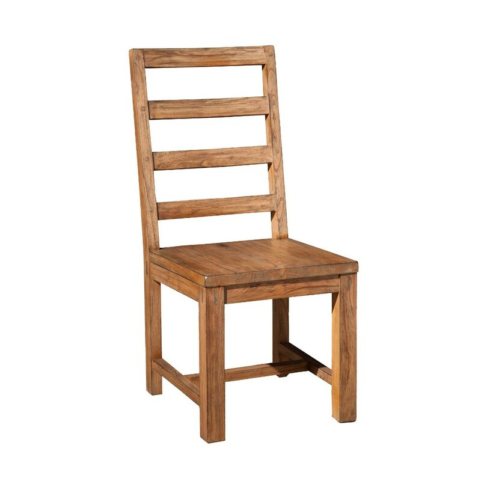

# Enhancement Two
## Algorithms and Data Structures 

### Explanation
For this category, the artifact I chose to enhance was the final project for the course CS330 - Computer Graphics and Visualization - which I took in the summer of 2020. In this project, we had to create a 3D lit and textured object with a toggle orthographic view using OpenGL and C++. An example of how this project looked when submitted can be seen [here](https://www.youtube.com/watch?v=XyaaWhLJi_w). I chose to include this artifact because at the time of the project I had written several hundred lines of repetitive code, roughly 350 lines, of plotting the 3D coordinates, normals and texture coordinates for each vertex of the chair. I wished to use this enhancement to demonstrate capability with algorithms and data structures to simply code like this and be more efficient and clean. 

### Enhancement Plan

The enhancement plan briefly mentioned above is to create functions and better use algorithms and data structures to reduce the amount of lines that it takes to plot the vertices of my object. In the case of my project, I had created a chair that was a simple wooden chair where I used the refernce image shown, and this required about 350 vertices which I did each one manually in the original rendition of the project. In the enhancement, I created a single function that takes in a vector arguent and 6 GLfloat values which represent 2 x-coordinate values, 2 y-coordinate values, and 2 z-coordinate values. With these 6 values, I am able to create a 3D piece of my chair with a single call of the function rather than 36 lines of manually placing coordinates for 6 vertices for each of the 6 sides. In this enhancement, for the purposes of the function, I also opted to use a vector before using an array because vectors are inherently dynamic and will expand without needing to be told to do so. Once I've finished filling the vector with the coordinates and information for the vertices, I transfer them to an array of the same so to use for the rest of the normal functions of the application.

### Outcomes
I chose this artifact because it was an opportunity to show that I can be presented with a problem, in this case a large meant of repetitive code or actions that would be difficult to edit or change, and find a solution to make things much easier to work with. I was also able to show a good use of functions and data structures like arrays and vectors to organize and simplify things. I achieved the goals for this enhancement and found the solution to simplify my code without a large number of challenges. The primary challenge I found was that I tried for a large portion of time to continue using arrays but ultimately used vectors instead for their flexibility. 

### Enhancement Two Files
[Github containing Original and Enhanced file versions](https://github.com/cnohilly/cnohilly.github.io/tree/main/Enhancement_Two_Files)

### Navigation
  - [Refinement Plan and Code Review](./refinement_codereview.md)
  - [Professional Self-Assessment](../index.md)
  - [Enhancement One](./enhancement_one.md)
  - [Enhancement Three](./enhancement_three.md)
